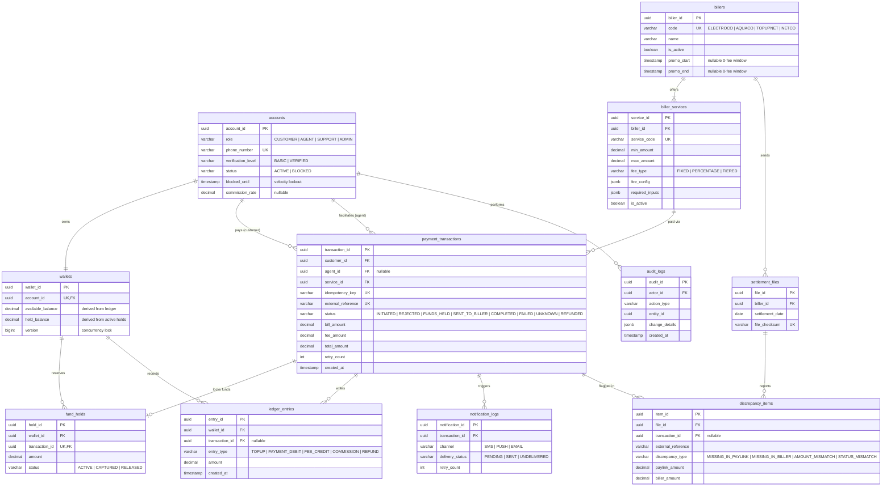

```mermaid
erDiagram
    accounts {
        uuid account_id PK
        varchar role "CUSTOMER | AGENT | SUPPORT | ADMIN"
        varchar phone_number UK
        varchar verification_level "BASIC | VERIFIED"
        varchar status "ACTIVE | BLOCKED"
        timestamp blocked_until "velocity lockout"
        decimal commission_rate "nullable"
    }

    wallets {
        uuid wallet_id PK
        uuid account_id UK, FK
        decimal available_balance "derived from ledger"
        decimal held_balance "derived from active holds"
        bigint version "concurrency lock"
    }

    fund_holds {
        uuid hold_id PK
        uuid wallet_id FK
        uuid transaction_id UK, FK
        decimal amount
        varchar status "ACTIVE | CAPTURED | RELEASED"
    }

    ledger_entries {
        uuid entry_id PK
        uuid wallet_id FK
        uuid transaction_id FK "nullable"
        varchar entry_type "TOPUP | PAYMENT_DEBIT | FEE_CREDIT | COMMISSION | REFUND"
        decimal amount
        timestamp created_at
    }

    billers {
        uuid biller_id PK
        varchar code UK "ELECTROCO | AQUACO | TOPUPNET | NETCO"
        varchar name
        boolean is_active
        timestamp promo_start "nullable 0-fee window"
        timestamp promo_end "nullable 0-fee window"
    }

    biller_services {
        uuid service_id PK
        uuid biller_id FK
        varchar service_code UK
        decimal min_amount
        decimal max_amount
        varchar fee_type "FIXED | PERCENTAGE | TIERED"
        jsonb fee_config
        jsonb required_inputs
        boolean is_active
    }

    payment_transactions {
        uuid transaction_id PK
        uuid customer_id FK
        uuid agent_id FK "nullable"
        uuid service_id FK
        varchar idempotency_key UK
        varchar external_reference UK
        varchar status "INITIATED | REJECTED | FUNDS_HELD | SENT_TO_BILLER | COMPLETED | FAILED | UNKNOWN | REFUNDED"
        decimal bill_amount
        decimal fee_amount
        decimal total_amount
        int retry_count
        timestamp created_at
    }

    notification_logs {
        uuid notification_id PK
        uuid transaction_id FK
        varchar channel "SMS | PUSH | EMAIL"
        varchar delivery_status "PENDING | SENT | UNDELIVERED"
        int retry_count
    }

    settlement_files {
        uuid file_id PK
        uuid biller_id FK
        date settlement_date
        varchar file_checksum UK
    }

    discrepancy_items {
        uuid item_id PK
        uuid file_id FK
        uuid transaction_id FK "nullable"
        varchar external_reference
        varchar discrepancy_type "MISSING_IN_PAYLINK | MISSING_IN_BILLER | AMOUNT_MISMATCH | STATUS_MISMATCH"
        decimal paylink_amount
        decimal biller_amount
    }

    audit_logs {
        uuid audit_id PK
        uuid actor_id FK
        varchar action_type
        uuid entity_id
        jsonb change_details
        timestamp created_at
    }

    %% Relationships
    accounts ||--|| wallets : "owns"
    wallets ||--o{ fund_holds : "reserves"
    wallets ||--o{ ledger_entries : "records"

    billers ||--|{ biller_services : "offers"
    billers ||--o{ settlement_files : "sends"

    accounts ||--o{ payment_transactions : "pays (customer)"
    accounts ||--o{ payment_transactions : "facilitates (agent)"
    accounts ||--o{ audit_logs : "performs"

    biller_services ||--o{ payment_transactions : "paid via"

    payment_transactions ||--o| fund_holds : "locks funds"
    payment_transactions ||--o{ ledger_entries : "writes"
    payment_transactions ||--o{ notification_logs : "triggers"
    payment_transactions ||--o{ discrepancy_items : "flagged in"

    settlement_files ||--o{ discrepancy_items : "reports"
```