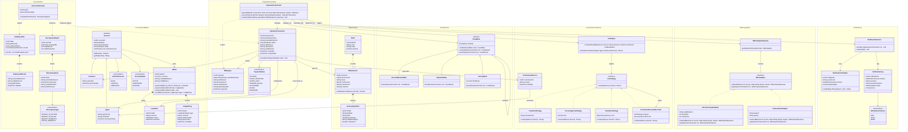

```mermaid
classDiagram
    direction TB

    %% ==========================================
    %% 1. ACCOUNTS AND WALLET
    %% ==========================================
    namespace AccountsAndWallet {
        class Account {
            <<abstract>>
            +UUID accountId
            +String fullName
            +String phoneNumber
            +AccountStatus status
            +VerificationLevel verificationLevel
            +isBlocked() boolean
            +getDailyLimit() Money
        }
        class Customer {
            +String nationalId
            +DateTime kycVerifiedAt
        }
        class Agent {
            +String agentCode
            +String terminalId
            +Decimal commissionRate
        }
        class Wallet {
            +UUID walletId
            +Currency currency
            +Money availableBalance
            +Money heldBalance
            +placeHold(Money amount, String ref) FundHold
            +captureHold(FundHold hold) LedgerEntry
            +releaseHold(FundHold hold) void
            +credit(Money amount, LedgerType type) LedgerEntry
        }
        class FundHold {
            +UUID holdId
            +Money amount
            +HoldStatus status
            +DateTime expiresAt
        }
        class LedgerEntry {
            +UUID entryId
            +LedgerEntryType type
            +Money amount
            +Money balanceAfter
            +String referenceId
            +DateTime createdAt
        }
        class VerificationLevel {
            <<enumeration>>
            BASIC
            VERIFIED
            MERCHANT
        }
        class AccountStatus {
            <<enumeration>>
            ACTIVE
            SUSPENDED
            BLOCKED
        }
    }

    Account <|-- Customer
    Account <|-- Agent
    Account "1" --> "1" Wallet : owns
    Account --> VerificationLevel
    Account --> AccountStatus
    Wallet "1" *-- "*" FundHold : tracks
    Wallet "1" *-- "*" LedgerEntry : records

    %% ==========================================
    %% 2. BILLER CATALOG
    %% ==========================================
    namespace BillerCatalog {
        class Biller {
            +UUID billerId
            +String code
            +String name
            +boolean isActive
        }
        class BillerService {
            +UUID serviceId
            +String serviceCode
            +String name
            +Money minAmount
            +Money maxAmount
            +boolean isActive
            +validateAmount(Money amount) boolean
        }
        class ServiceInputField {
            +UUID fieldId
            +String fieldKey
            +String label
            +FieldType dataType
            +String validationRegex
            +boolean isRequired
        }
    }

    Biller "1" *-- "1..*" BillerService : provides
    BillerService "1" *-- "1..*" ServiceInputField : requires

    %% ==========================================
    %% 3. PAYMENT PROCESSING
    %% ==========================================
    namespace PaymentProcessing {
        class PaymentOrchestrator {
            +inquireBill(UUID customerId, UUID serviceId, Map~String,String~ inputs) BillInquiry
            +executePayment(UUID inquiryId, String idempotencyKey) PaymentTransaction
            +handleCallback(String externalRef, BillerResponse response) void
        }
        class BillInquiry {
            +UUID inquiryId
            +Map~String,String~ inputParameters
            +Money billAmount
            +Money feeAmount
            +Money totalAmount
            +String billerInquiryRef
            +DateTime expiresAt
        }
        class PaymentTransaction {
            +UUID transactionId
            +String idempotencyKey
            +String externalReference
            +PaymentStatus status
            +Money billAmount
            +Money feeAmount
            +Money totalAmount
            +DateTime createdAt
            +DateTime completedAt
            +transitionTo(PaymentStatus next) void
        }
        class PaymentStatus {
            <<enumeration>>
            INITIATED
            FRAUD_REJECTED
            FUNDS_HELD
            PENDING_BILLER
            SUCCEEDED
            FAILED
            REVERSED
        }
    }

    PaymentOrchestrator ..> BillInquiry : creates
    PaymentOrchestrator ..> PaymentTransaction : manages
    PaymentTransaction --> PaymentStatus
    PaymentTransaction "1" --> "1" BillInquiry : settles
    PaymentTransaction "*" --> "1" Customer : paid by
    PaymentTransaction "*" --> "0..1" Agent : facilitated by
    PaymentTransaction "*" --> "1" BillerService : pays for
    PaymentTransaction "1" --> "0..1" FundHold : locks funds via

    %% ==========================================
    %% 4. FRAUD CHECKS (Chain of Responsibility)
    %% ==========================================
    namespace FraudChecks {
        class FraudRule {
            <<abstract>>
            #FraudRule nextRule
            +setNext(FraudRule next) FraudRule
            +evaluate(PaymentContext ctx) FraudResult
            #check(PaymentContext ctx)* FraudResult
        }
        class AccountBlockedRule {
            #check(PaymentContext ctx) FraudResult
        }
        class DailyLimitRule {
            #check(PaymentContext ctx) FraudResult
        }
        class VelocityRule {
            -int maxTxPerMinute
            #check(PaymentContext ctx) FraudResult
        }
    }

    FraudRule <|-- AccountBlockedRule
    FraudRule <|-- DailyLimitRule
    FraudRule <|-- VelocityRule
    FraudRule o-- "0..1" FraudRule : nextRule
    PaymentOrchestrator --> FraudRule : validates via

    %% ==========================================
    %% 5. FEES AND COMMISSIONS (Strategy)
    %% ==========================================
    namespace FeesAndCommissions {
        class FeeEngine {
            +calculateFee(BillerService service, Money amount, Customer customer) FeeBreakdown
            +calculateCommission(Agent agent, Money feeAmount) Money
        }
        class FeeStrategy {
            <<interface>>
            +compute(Money amount) Money
        }
        class FixedFeeStrategy {
            -Money fixedAmount
            +compute(Money amount) Money
        }
        class PercentageFeeStrategy {
            -Decimal rate
            +compute(Money amount) Money
        }
        class TieredFeeStrategy {
            -Map~Money,Money~ tiers
            +compute(Money amount) Money
        }
        class PromotionDiscountDecorator {
            -FeeStrategy wrapped
            -Decimal discountPercent
            +compute(Money amount) Money
        }
        class CommissionRecord {
            +UUID commissionId
            +Money amount
            +DateTime settledAt
        }
    }

    FeeStrategy <|.. FixedFeeStrategy
    FeeStrategy <|.. PercentageFeeStrategy
    FeeStrategy <|.. TieredFeeStrategy
    FeeStrategy <|.. PromotionDiscountDecorator
    PromotionDiscountDecorator o-- FeeStrategy : wraps
    FeeEngine --> FeeStrategy : applies
    PaymentOrchestrator --> FeeEngine : calculates with
    PaymentTransaction "1" --> "0..1" CommissionRecord : generates
    CommissionRecord "*" --> "1" Agent : earned by

    %% ==========================================
    %% 6. BILLER INTEGRATION (Adapter)
    %% ==========================================
    namespace BillerIntegration {
        class BillerAdapter {
            <<interface>>
            +inquire(BillerService service, Map~String,String~ inputs) BillerInquiryResponse
            +pay(PaymentTransaction tx) BillerPaymentResponse
        }
        class ElectroCoSoapAdapter {
            -String wsdlEndpoint
            -int timeoutMs
            -int maxRetries
            +inquire(BillerService service, Map~String,String~ inputs) BillerInquiryResponse
            +pay(PaymentTransaction tx) BillerPaymentResponse
        }
        class TelecomRestAdapter {
            -String baseUrl
            -String apiKey
            +inquire(BillerService service, Map~String,String~ inputs) BillerInquiryResponse
            +pay(PaymentTransaction tx) BillerPaymentResponse
        }
        class BillerAdapterRegistry {
            +getAdapter(String billerCode) BillerAdapter
        }
    }

    BillerAdapter <|.. ElectroCoSoapAdapter
    BillerAdapter <|.. TelecomRestAdapter
    BillerAdapterRegistry o-- "*" BillerAdapter : resolves
    PaymentOrchestrator --> BillerAdapterRegistry : dispatches via

    %% ==========================================
    %% 7. NOTIFICATIONS
    %% ==========================================
    namespace Notifications {
        class NotificationService {
            +sendReceipt(PaymentTransaction tx) void
            +retryFailed() void
        }
        class NotificationTemplate {
            +UUID templateId
            +String eventCode
            +NotificationChannel channel
            +String bodyTemplate
            +render(Map~String,Object~ vars) String
        }
        class NotificationLog {
            +UUID notificationId
            +NotificationChannel channel
            +String recipient
            +String renderedContent
            +DeliveryStatus status
            +int retryCount
        }
        class NotificationChannel {
            <<enumeration>>
            SMS
            PUSH
            EMAIL
        }
    }

    NotificationService --> NotificationTemplate : uses
    NotificationService --> NotificationLog : logs
    NotificationLog --> NotificationChannel
    PaymentOrchestrator --> NotificationService : triggers

    %% ==========================================
    %% 8. RECONCILIATION
    %% ==========================================
    namespace Reconciliation {
        class ReconciliationJob {
            +UUID jobId
            +Date settlementDate
            +run(SettlementFile file) DiscrepancyReport
        }
        class SettlementFile {
            +UUID fileId
            +String billerCode
            +Date settlementDate
            +List~SettlementRecord~ records
            +parse() List~SettlementRecord~
        }
        class SettlementRecord {
            +String externalReference
            +Money billedAmount
            +String billerStatus
            +DateTime settledAt
        }
        class DiscrepancyReport {
            +UUID reportId
            +DateTime generatedAt
            +int totalMatched
            +int totalMismatched
        }
        class DiscrepancyItem {
            +UUID itemId
            +String externalReference
            +DiscrepancyType type
            +Money paylinkAmount
            +Money billerAmount
        }
        class DiscrepancyType {
            <<enumeration>>
            MISSING_IN_PAYLINK
            MISSING_IN_BILLER
            AMOUNT_MISMATCH
            STATUS_MISMATCH
        }
    }

    SettlementFile "1" *-- "*" SettlementRecord : contains
    ReconciliationJob ..> SettlementFile : ingests
    ReconciliationJob ..> PaymentTransaction : compares against
    ReconciliationJob ..> DiscrepancyReport : produces
    DiscrepancyReport "1" *-- "*" DiscrepancyItem : details
    DiscrepancyItem --> DiscrepancyType
```