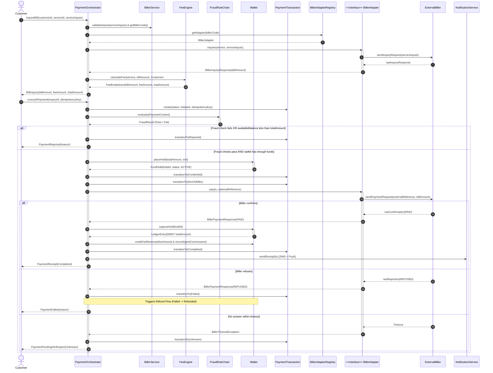

```mermaid
sequenceDiagram
    autonumber
    actor Customer
    participant Orch as PaymentOrchestrator
    participant Cat as BillerService
    participant Fee as FeeEngine
    participant Fraud as FraudRuleChain
    participant Wallet as Wallet
    participant Tx as PaymentTransaction
    participant Registry as BillerAdapterRegistry
    participant Adapter as <<interface>> BillerAdapter
    participant Biller as ExternalBiller
    participant Notif as NotificationService

    %% Step 2 & 3: Inquiry and Fee Calculation
    Customer->>Orch: inquireBill(customerId, serviceId, serviceInputs)
    activate Orch
    Orch->>Cat: validateInputs(serviceInputs) & getBillerCode()
    Orch->>Registry: getAdapter(billerCode)
    Registry-->>Orch: BillerAdapter
    Orch->>Adapter: inquire(service, serviceInputs)
    activate Adapter
    Adapter->>Biller: sendInquiryRequest(serviceInputs)
    Biller-->>Adapter: rawInquiryResponse
    Adapter-->>Orch: BillerInquiryResponse(billAmount)
    deactivate Adapter
    Orch->>Fee: calculateFee(service, billAmount, Customer)
    Fee-->>Orch: FeeBreakdown(billAmount, feeAmount, totalAmount)
    Orch-->>Customer: BillInquiry(billAmount, feeAmount, totalAmount)
    deactivate Orch

    %% Step 4 - 8: Payment Execution
    Customer->>Orch: executePayment(inquiryId, idempotencyKey)
    activate Orch
    Orch->>Tx: create(status: Initiated, idempotencyKey)

    %% Fraud & Balance Validation
    Orch->>Fraud: evaluate(PaymentContext)
    activate Fraud
    Fraud-->>Orch: FraudResult (Pass / Fail)
    deactivate Fraud

    alt Fraud check fails OR availableBalance less than totalAmount
        Orch->>Tx: transitionTo(Rejected)
        Orch-->>Customer: PaymentRejected(reason)
    else Fraud checks pass AND wallet has enough funds
        Orch->>Wallet: placeHold(totalAmount, txId)
        activate Wallet
        Wallet-->>Orch: FundHold(holdId, status: ACTIVE)
        deactivate Wallet
        Orch->>Tx: transitionTo(FundsHeld)

        %% Dispatch to Abstract Biller
        Orch->>Tx: transitionTo(SentToBiller)
        Orch->>Adapter: pay(tx, externalReference)
        activate Adapter
        Adapter->>Biller: sendPaymentRequest(externalReference, billAmount)

        alt Biller confirms
            Biller-->>Adapter: rawConfirmation(PAID)
            Adapter-->>Orch: BillerPaymentResponse(PAID)
            Orch->>Wallet: captureHold(holdId)
            activate Wallet
            Wallet-->>Orch: LedgerEntry(DEBIT totalAmount)
            deactivate Wallet
            Orch->>Wallet: creditFeeRevenue(feeAmount) & recordAgentCommission()
            Orch->>Tx: transitionTo(Completed)
            Orch->>Notif: sendReceipt(tx) [SMS + Push]
            Orch-->>Customer: PaymentReceipt(Completed)

        else Biller refuses
            Biller-->>Adapter: rawRejection(REFUSED)
            Adapter-->>Orch: BillerPaymentResponse(REFUSED)
            Orch->>Tx: transitionTo(Failed)
            Note over Orch,Wallet: Triggers Refund Flow (Failed -> Refunded)
            Orch-->>Customer: PaymentFailed(reason)

        else No answer within timeout
            Biller--xAdapter: Timeout
            Adapter--xOrch: BillerTimeoutException
            deactivate Adapter
            Orch->>Tx: transitionTo(Unknown)
            Orch-->>Customer: PaymentPendingVerification(Unknown)
        end
    end
    deactivate Orch
```