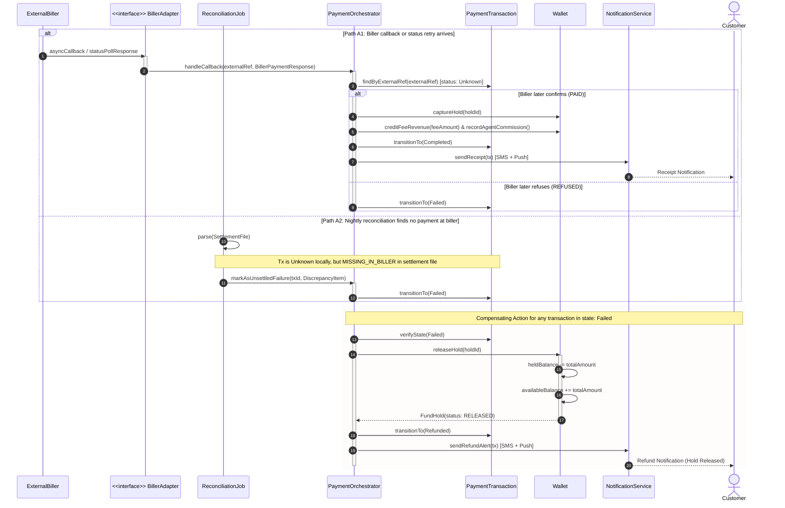

```mermaid
sequenceDiagram
    autonumber
    participant Biller as ExternalBiller
    participant Adapter as <<interface>> BillerAdapter
    participant Recon as ReconciliationJob
    participant Orch as PaymentOrchestrator
    participant Tx as PaymentTransaction
    participant Wallet as Wallet
    participant Notif as NotificationService
    actor Customer

    %% Phase A: Resolving an Unknown Payment
    alt Path A1: Biller callback or status retry arrives
        Biller->>Adapter: asyncCallback / statusPollResponse
        activate Adapter
        Adapter->>Orch: handleCallback(externalRef, BillerPaymentResponse)
        deactivate Adapter
        activate Orch
        Orch->>Tx: findByExternalRef(externalRef) [status: Unknown]
        alt Biller later confirms (PAID)
            Orch->>Wallet: captureHold(holdId)
            Orch->>Wallet: creditFeeRevenue(feeAmount) & recordAgentCommission()
            Orch->>Tx: transitionTo(Completed)
            Orch->>Notif: sendReceipt(tx) [SMS + Push]
            Notif-->>Customer: Receipt Notification
        else Biller later refuses (REFUSED)
            Orch->>Tx: transitionTo(Failed)
        end
        deactivate Orch

    else Path A2: Nightly reconciliation finds no payment at biller
        Recon->>Recon: parse(SettlementFile)
        Note over Recon,Tx: Tx is Unknown locally, but MISSING_IN_BILLER in settlement file
        Recon->>Orch: markAsUnsettledFailure(txId, DiscrepancyItem)
        activate Orch
        Orch->>Tx: transitionTo(Failed)
        deactivate Orch
    end

    %% Phase B: Refunding any Failed Payment (Immediate or Delayed)
    rect rgba(255, 235, 235, 0.15)
        Note over Orch,Customer: Compensating Action for any transaction in state: Failed
        Orch->>Tx: verifyState(Failed)
        activate Orch
        Orch->>Wallet: releaseHold(holdId)
        activate Wallet
        Wallet->>Wallet: heldBalance -= totalAmount
        Wallet->>Wallet: availableBalance += totalAmount
        Wallet-->>Orch: FundHold(status: RELEASED)
        deactivate Wallet

        Orch->>Tx: transitionTo(Refunded)
        Orch->>Notif: sendRefundAlert(tx) [SMS + Push]
        Notif-->>Customer: Refund Notification (Hold Released)
        deactivate Orch
    end
```