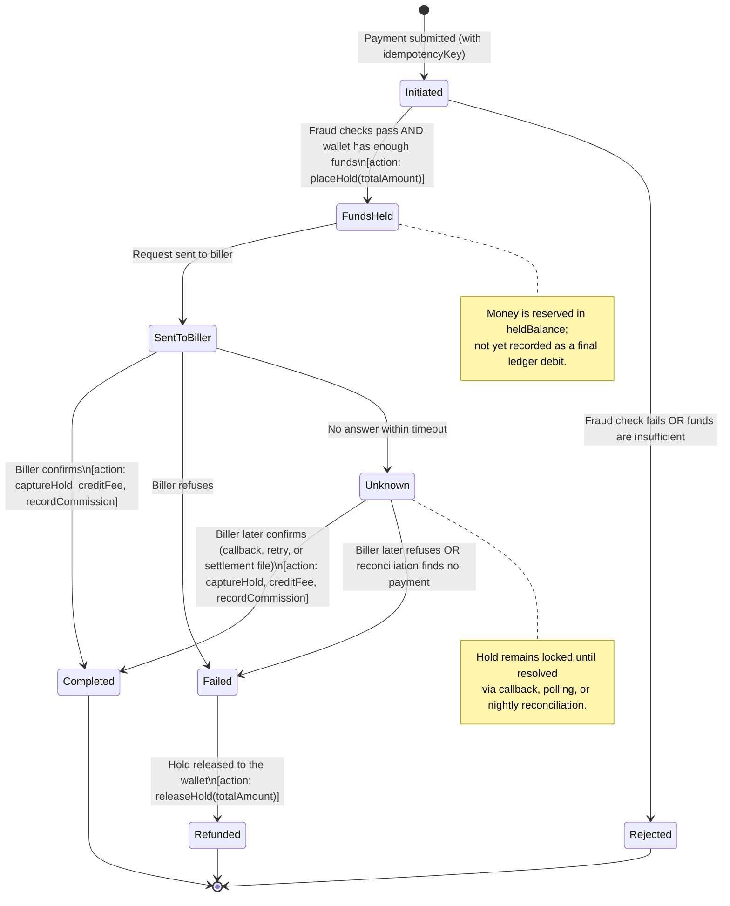

```mermaid
stateDiagram-v2
    direction TB

    [*] --> Initiated : Payment submitted (with idempotencyKey)

    Initiated --> FundsHeld : Fraud checks pass AND wallet has enough funds\n[action: placeHold(totalAmount)]
    Initiated --> Rejected : Fraud check fails OR funds are insufficient

    FundsHeld --> SentToBiller : Request sent to biller

    SentToBiller --> Completed : Biller confirms\n[action: captureHold, creditFee, recordCommission]
    SentToBiller --> Failed : Biller refuses
    SentToBiller --> Unknown : No answer within timeout

    Unknown --> Completed : Biller later confirms (callback, retry, or settlement file)\n[action: captureHold, creditFee, recordCommission]
    Unknown --> Failed : Biller later refuses OR reconciliation finds no payment

    Failed --> Refunded : Hold released to the wallet\n[action: releaseHold(totalAmount)]

    Rejected --> [*]
    Completed --> [*]
    Refunded --> [*]

    note right of FundsHeld
        Money is reserved in heldBalance;
        not yet recorded as a final ledger debit.
    end note

    note right of Unknown
        Hold remains locked until resolved
        via callback, polling, or nightly reconciliation.
    end note
```