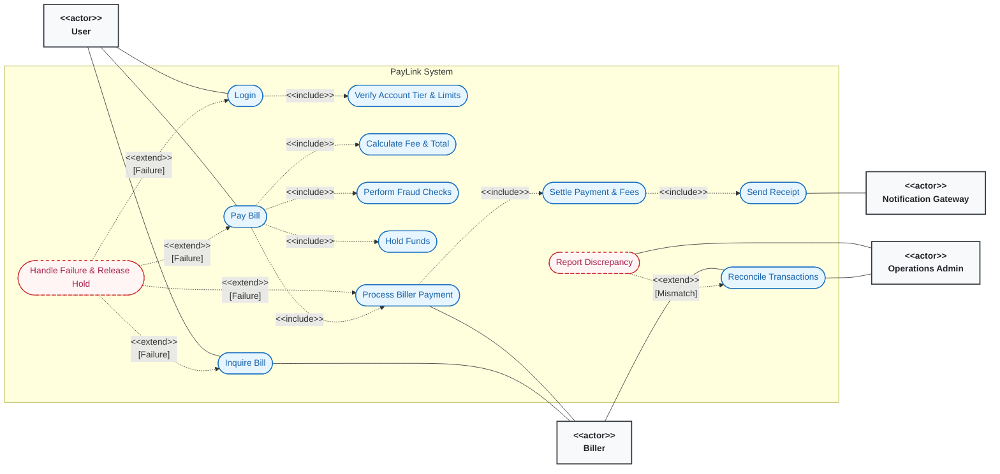

```mermaid
flowchart LR
    %% Actors (UML <<actor>> Stereotype Notation)
    User["&lt;&lt;actor&gt;&gt;<br/>User"]
    Biller["&lt;&lt;actor&gt;&gt;<br/>Biller"]
    NotificationGateway["&lt;&lt;actor&gt;&gt;<br/>Notification Gateway"]
    Admin["&lt;&lt;actor&gt;&gt;<br/>Operations Admin"]

    %% System Boundary
    subgraph PayLink ["PayLink System"]
        direction TB

        %% Generalized Core Use Cases
        UC_Login(["Login"])
        UC_CheckTier(["Verify Account Tier & Limits"])
        UC_Inquiry(["Inquire Bill"])
        UC_CalcFee(["Calculate Fee & Total"])
        UC_PayBill(["Pay Bill"])
        UC_Fraud(["Perform Fraud Checks"])
        UC_Hold(["Hold Funds"])
        UC_ProcessBiller(["Process Biller Payment"])
        UC_Settle(["Settle Payment & Fees"])
        UC_Receipt(["Send Receipt"])
        UC_Recon(["Reconcile Transactions"])

        %% Generalized Exception / Extension Use Cases
        UC_Fail(["Handle Failure & Release Hold"])
        UC_Discrepancy(["Report Discrepancy"])

        %% <<include>> Relationships
        UC_Login -.->|"&lt;&lt;include&gt;&gt;"| UC_CheckTier
        UC_PayBill -.->|"&lt;&lt;include&gt;&gt;"| UC_CalcFee
        UC_PayBill -.->|"&lt;&lt;include&gt;&gt;"| UC_Fraud
        UC_PayBill -.->|"&lt;&lt;include&gt;&gt;"| UC_Hold
        UC_PayBill -.->|"&lt;&lt;include&gt;&gt;"| UC_ProcessBiller
        UC_ProcessBiller -.->|"&lt;&lt;include&gt;&gt;"| UC_Settle
        UC_Settle -.->|"&lt;&lt;include&gt;&gt;"| UC_Receipt

        %% <<extend>> Relationships
        UC_Fail -.->|"&lt;&lt;extend&gt;&gt;<br/>[Failure]"| UC_Login
        UC_Fail -.->|"&lt;&lt;extend&gt;&gt;<br/>[Failure]"| UC_Inquiry
        UC_Fail -.->|"&lt;&lt;extend&gt;&gt;<br/>[Failure]"| UC_PayBill
        UC_Fail -.->|"&lt;&lt;extend&gt;&gt;<br/>[Failure]"| UC_ProcessBiller
        UC_Discrepancy -.->|"&lt;&lt;extend&gt;&gt;<br/>[Mismatch]"| UC_Recon
    end

    %% Actor Associations
    User --- UC_Login
    User --- UC_Inquiry
    User --- UC_PayBill

    UC_Inquiry --- Biller
    UC_ProcessBiller --- Biller
    Biller --- UC_Recon

    UC_Receipt --- NotificationGateway
    UC_Recon --- Admin
    UC_Discrepancy --- Admin

    %% Styling
    classDef actor fill:#f8f9fa,stroke:#343a40,stroke-width:2px,color:#212529,font-weight:bold;
    classDef usecase fill:#e7f5ff,stroke:#1971c2,stroke-width:1.5px,color:#1864ab;
    classDef exception fill:#fff5f5,stroke:#c92a2a,stroke-width:1.5px,stroke-dasharray: 5 5,color:#a61e4d;

    class User,Biller,NotificationGateway,Admin actor;
    class UC_Login,UC_CheckTier,UC_Inquiry,UC_CalcFee,UC_PayBill,UC_Fraud,UC_Hold,UC_ProcessBiller,UC_Settle,UC_Receipt,UC_Recon usecase;
    class UC_Fail,UC_Discrepancy exception;
```